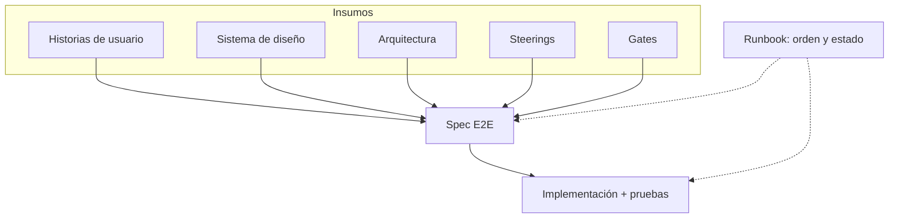

# Molde

Plantilla de **Spec-Driven Development** para un solo agente. Un `AGENTS.md`, un catálogo, un runbook. Sin orquesta de roles.

**Repo:** [`sdd-molde`](https://github.com/salim-castellanos/sdd-molde) · **Qué es (y qué no):** [docs/00-howto/que-es.md](docs/00-howto/que-es.md)

El contrato del agente es [AGENTS.md](AGENTS.md). El avance del producto de ejemplo (Clave) está en [STATUS.md](STATUS.md).

## Para quién

Quien construye con un agente (Cursor, Kiro, Copilot, Claude Code, Codex) y necesita un repo que ya sepa dónde vive cada cosa: historias, arquitectura, diseño, specs y código.

Si buscabas **BMAD**: ese método reparte el trabajo entre muchos agentes-rol. Molde es SDD **simplificado**: un agente, docs visibles, spec compuesta, gates. Comparación: [qué es](docs/00-howto/que-es.md).

## Qué resuelve

- Un workspace listo: documentación, catálogos y huecos de `apps/`, no una carpeta vacía.
- Un método único, portable: `AGENTS.md` + `docs/`. No un cerebro por herramienta.
- El loop SDD de 2025–2026 (constitución → spec → plan → tasks → calidad) **visible** en `docs/`, no escondido en `.specify/` ni en packs de vendor.
- Monorepo al empezar; cada app se puede extraer a submodule después.

## Inicio rápido

1. En GitHub: **Use this template** (o clona el repo).
2. Ábrelo en tu IDE. Acepta las extensiones recomendadas si estás en la familia VS Code.
3. Reescribe [docs/01-steering/context/product.md](docs/01-steering/context/product.md) y pide al agente: *sigue el runbook 001-identidad*.

Guía de fork: [docs/00-howto/usar-esta-plantilla.md](docs/00-howto/usar-esta-plantilla.md).  
Cómo lo lee el IDE: [docs/00-howto/abrir-en-el-ide.md](docs/00-howto/abrir-en-el-ide.md).

No empieces por el código. Primero se **compone** la spec; el [runbook](docs/07-runbooks/001-identidad/runbook.md) dice en qué orden.

## Cómo se trabaja

La spec no sale de una HU sola. Se **compone**: es el end-to-end de una funcionalidad (pantalla, validación, mensajes, autenticación, autorización y cómo se prueba). Los insumos no se ejecutan; la spec sí.

El runbook no reemplaza la spec: ordena dependencias (autorización antes que registro) y actualiza [STATUS.md](STATUS.md).

Qué entra en una spec: [docs/01-steering/especificacion.md](docs/01-steering/especificacion.md). Loop: [docs/00-howto/sdd-loop.md](docs/00-howto/sdd-loop.md). Por qué esta forma: [docs/00-howto/estado-del-arte.md](docs/00-howto/estado-del-arte.md).

## Layout

| Ruta | Rol |
| --- | --- |
| `AGENTS.md` | Contrato de cualquier agente |
| `STATUS.md` | Informe ejecutivo del **producto del fork** (rollup) |
| `docs/` | Conocimiento: steering, gates, arch, diseño, HUs, specs, runbooks |
| `apps/` | Artefactos de **tu** fork (vacíos en el molde) |

Índice: [docs/README.md](docs/README.md).

## Documentación

| Tema | Dónde |
| --- | --- |
| Qué es Molde (vs BMAD, Spec Kit, Kiro) | [docs/00-howto/que-es.md](docs/00-howto/que-es.md) |
| Estado del ejemplo (Clave) | [STATUS.md](STATUS.md) |
| Catálogo de steering | [docs/01-steering/catalog.md](docs/01-steering/catalog.md) |
| Arquitectura | [docs/03-architecture/catalog.md](docs/03-architecture/catalog.md) |
| Diseño | [docs/04-design/catalog.md](docs/04-design/catalog.md) |
| Backlog (módulo → épica → feature → HU) | [docs/05-backlog/catalog.md](docs/05-backlog/catalog.md) |
| Monorepo y submodules | [docs/00-howto/monorepo-vs-submodules.md](docs/00-howto/monorepo-vs-submodules.md) |

## Licencia

[MIT](LICENSE).
