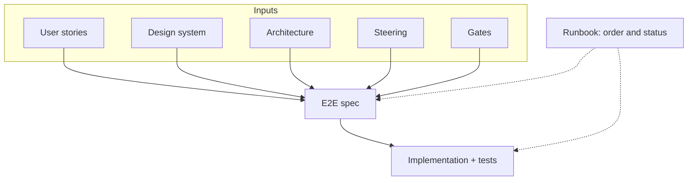

# Molde

**English** | [Español](./README.es.md)

A **Spec-Driven Development** workspace template for a single agent. One `AGENTS.md`, one catalog, one runbook. No role orchestra.

**Repo:** [`sdd-molde`](https://github.com/salim-castellanos/sdd-molde) · **What it is (and is not):** [docs/00-howto/que-es.en.md](docs/00-howto/que-es.en.md) · Languages: [docs/00-howto/i18n.md](docs/00-howto/i18n.md)

The agent contract is [AGENTS.md](AGENTS.md). Progress for the sample product (Clave) lives in [STATUS.md](STATUS.md).

## Who it is for

Anyone building with an agent (Cursor, Kiro, Copilot, Claude Code, Codex) who needs a repo that already knows where things live: stories, architecture, design, specs, and code.

If you were looking for **BMAD**: that method splits work across many role-agents. Molde is **simpler** SDD: one agent, visible docs, a composed spec, gates. Comparison: [what it is](docs/00-howto/que-es.en.md).

## What it solves

- A ready workspace: documentation, catalogs, and empty `apps/` slots — not a blank folder.
- One portable method: `AGENTS.md` + `docs/`. Not one brain per tool.
- The 2025–2026 SDD loop (constitution → spec → plan → tasks → quality) **visible** in `docs/`, not hidden in `.specify/` or a vendor pack.
- Monorepo first; each app can become a submodule later.

## Quick start

1. On GitHub: **Use this template** (or clone the repo).
2. Open it in your IDE. Accept the recommended extensions if you are in the VS Code family.
3. Rewrite [docs/01-steering/context/product.md](docs/01-steering/context/product.md) and ask the agent: *follow runbook 001-identidad*.

Fork guide: [docs/00-howto/usar-esta-plantilla.md](docs/00-howto/usar-esta-plantilla.md) (Spanish).  
How the IDE reads it: [docs/00-howto/abrir-en-el-ide.md](docs/00-howto/abrir-en-el-ide.md).

Do not start with code. Compose the spec first; the [runbook](docs/07-runbooks/001-identidad/runbook.md) sets the order.

## How work happens

A spec does not come from a user story alone. It is **composed**: the end-to-end of one capability (screen, validation, messages, authn, authz, and how it is tested). Inputs are not executed; the spec is.

The runbook does not replace the spec: it orders dependencies (authorization before sign-up) and updates [STATUS.md](STATUS.md).

What belongs in a spec: [docs/01-steering/especificacion.md](docs/01-steering/especificacion.md). Loop: [docs/00-howto/sdd-loop.md](docs/00-howto/sdd-loop.md). Why this shape: [docs/00-howto/estado-del-arte.md](docs/00-howto/estado-del-arte.md).

## Layout

| Path | Role |
| --- | --- |
| `AGENTS.md` | Contract for any agent |
| `STATUS.md` | Executive report for the **fork’s product** (rollup) |
| `docs/` | Knowledge: steering, gates, arch, design, stories, specs, runbooks |
| `apps/` | Artifacts of **your** fork (empty in the template) |

Index: [docs/README.md](docs/README.md).

## Documentation

| Topic | Where |
| --- | --- |
| What Molde is (vs BMAD, Spec Kit, Kiro) | [docs/00-howto/que-es.en.md](docs/00-howto/que-es.en.md) |
| English / Spanish convention | [docs/00-howto/i18n.md](docs/00-howto/i18n.md) |
| Sample product status (Clave) | [STATUS.md](STATUS.md) |
| Steering catalog | [docs/01-steering/catalog.md](docs/01-steering/catalog.md) |
| Architecture | [docs/03-architecture/catalog.md](docs/03-architecture/catalog.md) |
| Design | [docs/04-design/catalog.md](docs/04-design/catalog.md) |
| Backlog (module → epic → feature → story) | [docs/05-backlog/catalog.md](docs/05-backlog/catalog.md) |
| Monorepo and submodules | [docs/00-howto/monorepo-vs-submodules.md](docs/00-howto/monorepo-vs-submodules.md) |

## License

[MIT](LICENSE).
