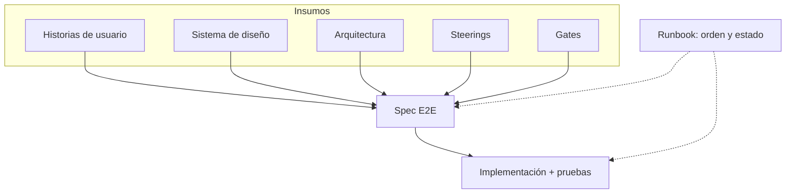

# solucion-sdd

Plantilla de workspace para **Spec-Driven Development**. Clónala e inicia un producto sin diseñar el arquetipo desde cero.

El contrato del agente es [AGENTS.md](AGENTS.md). El avance del ejemplo vivo está en [STATUS.md](STATUS.md).

## Para quién

Quien quiere construir con un agente (Cursor, Kiro, Copilot, Claude Code, …) y necesita un repo que ya sepa dónde vive cada cosa: historias, arquitectura, diseño, specs y código.

## Qué resuelve

- Un workspace listo: documentación, catálogos y huecos de `apps/`, no una carpeta vacía.
- Un método único, portable: `AGENTS.md` + `docs/`. No un cerebro por herramienta.
- Una instancia con el **mismo árbol** en `example/`: **otro git** (Mistratos). En este disco vive al lado del molde; no viaja en el clone del molde. Los huecos vuelven vía `example/GAPS.md`.
- Monorepo al empezar; cada app se puede extraer a un git submodule después.

## Inicio rápido

1. Usa este repositorio como template o clónalo.
2. Ábrelo en tu IDE. Acepta las extensiones recomendadas si te encuentras en la familia VS Code.
3. Reescribe [docs/01-steering/context/product.md](docs/01-steering/context/product.md) y pide al agente: *sigue el runbook 001-identidad*.

Guía de fork: [docs/00-howto/usar-esta-plantilla.md](docs/00-howto/usar-esta-plantilla.md).  
Cómo lo lee el IDE: [docs/00-howto/abrir-en-el-ide.md](docs/00-howto/abrir-en-el-ide.md).

No empieces por el código. Primero se **compone** la spec; el [runbook](docs/07-runbooks/001-identidad/runbook.md) dice en qué orden.

## Cómo se trabaja

La spec no sale de una HU sola. Se **compone**: es el end-to-end de una funcionalidad (pantalla, validación, mensajes, autenticación, autorización y cómo se prueba). Los insumos no se ejecutan; la spec sí.

El runbook no reemplaza la spec: ordena dependencias (autorización antes que registro) y actualiza [STATUS.md](STATUS.md).

Qué entra en una spec: [docs/01-steering/especificacion.md](docs/01-steering/especificacion.md). Loop: [docs/00-howto/sdd-loop.md](docs/00-howto/sdd-loop.md).

## Layout

| Ruta | Rol |
| --- | --- |
| `AGENTS.md` | Contrato de cualquier agente |
| `STATUS.md` | Informe ejecutivo (rollup) |
| `docs/` | Conocimiento: steering, gates, arch, diseño, HUs, specs, runbooks |
| `apps/` | Artefactos de **tu** fork (vacíos en el molde) |
| `example/` | Instancia Mistratos; **repo independiente** (gitignored aquí) |

Índice de documentación: [docs/README.md](docs/README.md).

## Documentación

| Tema | Dónde |
| --- | --- |
| Estado del ejemplo | [STATUS.md](STATUS.md) |
| Catálogo de steering | [docs/01-steering/catalog.md](docs/01-steering/catalog.md) |
| Arquitectura | [docs/03-architecture/catalog.md](docs/03-architecture/catalog.md) |
| Diseño | [docs/04-design/catalog.md](docs/04-design/catalog.md) |
| Backlog (módulo → épica → feature → HU) | [docs/05-backlog/catalog.md](docs/05-backlog/catalog.md) |
| Instancia (mismo árbol) | [example/README.md](example/README.md) |
| Monorepo y submodules | [docs/00-howto/monorepo-vs-submodules.md](docs/00-howto/monorepo-vs-submodules.md) |

## Licencia

[MIT](LICENSE).
