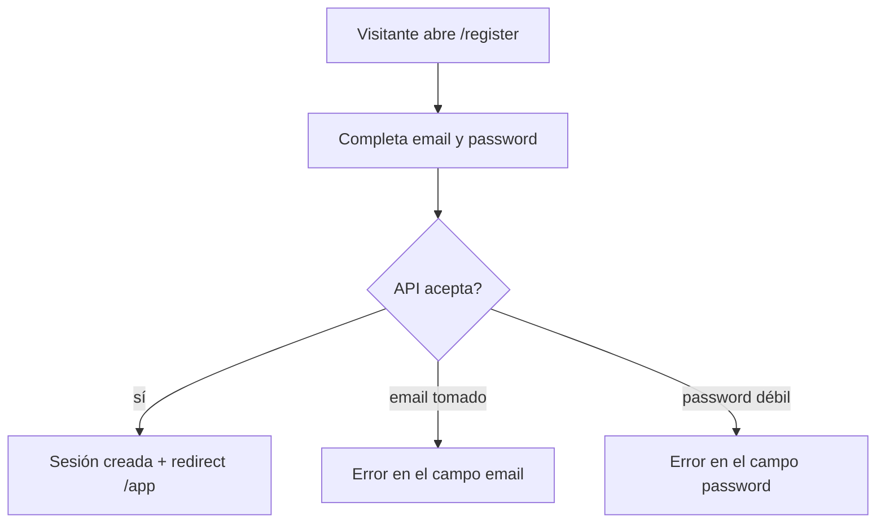

# Flujos de auth

## Registro



## Login

```mermaid
flowchart TD
  A[Visitante abre /login] --> B[Email + password]
  B --> C{Credenciales?}
  C -->|ok| D[/app según rol]
  C -->|no| E[Error genérico: no revelar si el email existe]
```

## Reset de contraseña

```mermaid
flowchart TD
  A[/forgot-password] --> B[Pide email]
  B --> C[API siempre responde OK]
  C --> D[Si el email existe: mail con enlace /reset-password?token=]
  D --> E[Usuario define password nueva]
  E --> F[Token se consume; redirect /login]
```

El mensaje de “si el email existe, te escribimos” es el mismo siempre. Eso es requisito, no copy.

## Autorización en UI

```mermaid
flowchart LR
  A[/me] --> B{permisos}
  B -->|users.role.assign| C[Muestra admin users]
  B -->|no| D[No renderiza la acción]
```

Ocultar no autoriza. El api vuelve `403` si se fuerza la llamada.
