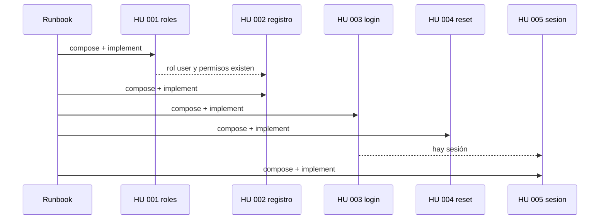

# Runbook 001 — Identidad

## Objetivo

Dejar Clave con registro, sesión, reset y permisos reales en BD. Las HUs ya existen; las specs **aún no**. No se implementa hasta componer.

## Negocio (por qué este orden)

`001-roles-permisos` es la paleta: registro, login, reset y `/me` la usan a mitad de flujo (asignar rol `user`, resolver 403, pintar admin). Se compone y se ejecuta **antes**.

## Pasos

| # | Tipo | Qué | Insumos | Status | % |
| --- | --- | --- | --- | --- | --- |
| 1 | analyze | Cerrar diagrama y lista de HUs | catálogo stories E-001 | `done` | 100 |
| 2 | compose | Spec `001-roles-permisos` | HU-001 + arch `iam`/`c4` + `/app/users` + cards `arquitectura`, `diseno` | `pending` | 0 |
| 3 | implement | Ejecutar spec `001-roles-permisos` | esa spec | `blocked` | 0 |
| 4 | compose | Spec `002-registro` | HU 002 + diseño `/register` + `formularios` + spec 001 hecha | `pending` | 0 |
| 5 | implement | Ejecutar spec `002-registro` | esa spec | `blocked` | 0 |
| 6 | compose | Spec `003-login` | HU 003 + `/login` + `formularios` | `pending` | 0 |
| 7 | implement | Ejecutar spec `003-login` | esa spec | `blocked` | 0 |
| 8 | compose | Spec `004-reset-password` | HU 004 + forgot/reset + `formularios` | `pending` | 0 |
| 9 | implement | Ejecutar spec `004-reset-password` | esa spec | `blocked` | 0 |
| 10 | compose | Spec `005-sesion` | HU 005 + `/app` + spec 003 | `pending` | 0 |
| 11 | implement | Ejecutar spec `005-sesion` | esa spec | `blocked` | 0 |
| 12 | close | G5: drift HU / spec / código | runbook + specs del corte | `pending` | 0 |

`progress` = pasos `done` / 12 × 100. Hoy 1/12 ≈ **8%**.

## Estado actual

- **Paso 1 hecho:** HUs partidas, secuencia acordada.
- **Siguiente:** paso 2 — componer `docs/06-specs/001-roles-permisos/` desde `…/F-001-autorizacion/HU-001-roles-permisos.md`. No codear.
- **Bloqueos:** 3, 5, 7, 9, 11 esperan su `compose` en G1–G3.

## Cómo se actualiza

Al terminar un paso: `status` de la fila → `done`, `step` → siguiente, `progress` → done/12*100, dos líneas en *Estado actual*. En el mismo turno: reescribe [STATUS.md](../../../STATUS.md).
