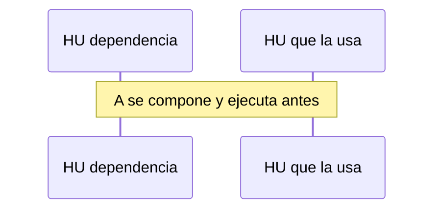

# Runbook 00N — Título

## Objetivo

## Negocio (secuencia)

## Pasos

| # | Tipo | Qué | Insumos | Status | % |
| --- | --- | --- | --- | --- | --- |
| 1 | analyze | … | HUs | `pending` | 0 |
| 2 | compose | Spec de HU-… | HU + diseño + arch + cards | `pending` | 0 |
| 3 | implement | Ejecutar esa spec | spec | `blocked` | 0 |

## Estado actual

- Paso corriente:
- Siguiente:
- Bloqueos:

Al crear este archivo y al cerrar cada paso: reescribir `STATUS.md` (card `status`). Al cerrar el runbook: card `lecciones`.
