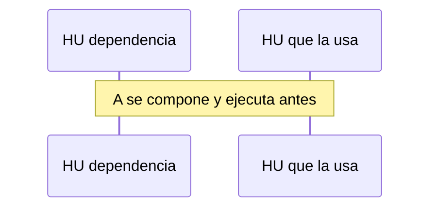

# Runbook 00N — Título

## Objetivo

## HUs (fuente del qué)

Lista con enlace a cada `docs/05-backlog/…/HU-….md`. Sin esta lista el runbook no está listo.

- [HU-NNN](../../05-backlog/…)

## Negocio (secuencia)

```mermaid
sequenceDiagram
  participant A as HU dependencia
  participant B as HU que la usa
  Note over A,B: A se compone y ejecuta antes
```

## Pasos

| # | Tipo | Qué | Insumos | Status | % |
| --- | --- | --- | --- | --- | --- |
| 1 | analyze | … | HUs | `pending` | 0 |
| 2 | compose | Spec de HU-… | HU + diseño + arch + cards | `pending` | 0 |
| 3 | implement | Ejecutar esa spec | spec | `blocked` | 0 |

## Estado actual

- Paso corriente:
- Siguiente:
- Bloqueos:

Al crear este archivo y al cerrar cada paso: reescribir `STATUS.md` (card `status`). Al cerrar el runbook: card `lecciones`.

`status` del runbook: `in-progress` mientras el paso es `compose` o `implement`. Si el `close` lo reserva el humano, `awaiting-human` (no es la cola, no se marca `closed` desde el agente). `closed` cuando G5 está hecho. El % es pasos `done` / total; `awaiting-human` no cuenta el cierre como `done`.
